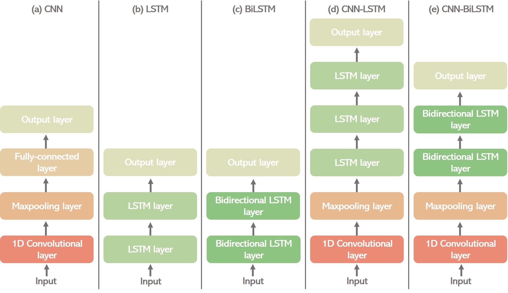
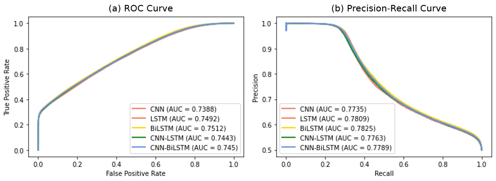
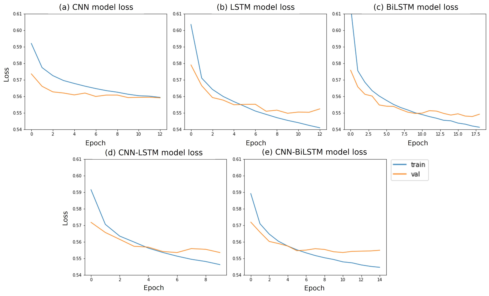
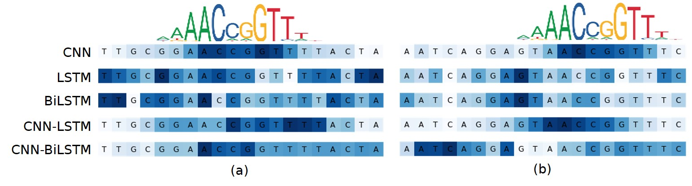

# Transcription Factor Binding Site Prediction using ML
- Apply ML to predict Transcription Factor Binding Site (TFBS)
- Compare different types of neural networks
- Train the models with grainyhead-like 1 (GRHL1) TFBS sequences obtained by HT-SELEX
- Visualize what the model learns from given sequences

 

### Model Architecture
 
- Build 5 different neural network models
- Hyperparameter tuning by [GridSearchCV](https://scikit-learn.org/stable/modules/generated/sklearn.model_selection.GridSearchCV.html)

 

### Result
##### 1. Receiver operating characteristic (ROC) curve and precision-recall (PR) curve and The area under the curve (AUC) of both curves 
 
  
 

##### 2. Loss curve of models by each epoch  
 
 
 

##### Visualization
 
- Heatmap shows the importance of each nucleotide for determining the class of a given sequence.
- The top of it shows GRHL1 canonical motif from [JASPAR](https://jaspar.genereg.net/matrix/MA0647.1/).
